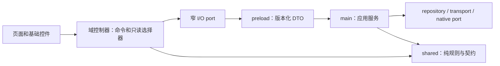

# 模块解耦、运行效率与内存治理方案

日期：2026-09-30。基线：1.2.4 / `37d5d95`，包括已合并的 #97、#98。

## 目标与执行状态

目标是修复可复现的状态与资源问题，把状态提交权、I/O 和生命周期放到明确的模块中，减少重复计算、IPC、文件解析与长期引用。文件数和行数不作为优化收益。

首批已经实现网络目录/媒体库状态、索引持久化与协议资源缓存治理，并补齐焦点资源生命周期。第二批继续实施播放器系统集成/睡眠定时器、创建/加歌事务及歌词依赖分层；播放器队列状态所有者、剩余详情事务、插件和 UI 基础组件仍属后续设计。没有改变存储 schema、IPC 频道或插件公共协议。原有脏工作目录保持独立。

## 当前证据与首批修复

| 问题 | 实际证据 | 首批处理 |
| --- | --- | --- |
| 并发入库覆盖索引 | 原模块 10 个来源同时入库，最终 JSON 仅保留 1 个来源 | 单个 repository 串行提交，读取等待先前提交；失败不阻塞下一事务；同目录临时文件 rename 发布 |
| 元数据解析复活已删除歌曲 | updateEntries 原来会添加未知 ID；长时间解析完成前用户可能已移除歌曲 | 只合并仍存在的 ID，移除后的条目不被迟到结果重新加入 |
| 多来源搜索重复解析 | 页面逐来源调用 IPC；主进程逐来源读完整 JSON、解析整个索引 | 复用既有 searchLibrary IPC，单次索引快照搜索全部来源；只克隆返回的匹配结果 |
| 目录/查询竞态 | `/slow-A` 后 `/fast-B`，迟到 A 可以覆盖 B 内容/错误/loading | 独立控制器拥有结果与代次；离开、切来源和销毁失效；不共用目录读取与批量播放 busy 状态 |
| 高频输入放大请求 | 原媒体库每次 input 立即遍历来源 | 150ms 防抖，期间立即废止旧请求，离开/卸载取消计时器；一个查询只发送一个 IPC |
| 响应数据代理与保留 | 大列表原来放入普通 ref，页面自己管理迟到结果 | 控制器用 shallowRef 替换快照，减少逐项深层响应式代理；销毁释放当前列表和 timer |
| 资源缓存预算不严格 | 原 eviction 在只剩一项时停止，单个大资产仍能超预算；空文件项数未受限 | 64 MiB 字节预算 + 512 项上限；超大内容返回但不保留；相同路径在途读取合并；clear 代次防旧结果重新进入缓存 |
| 弹层资源生命周期 | 初始 open 没有焦点约束，关闭过渡时焦点不恢复，打开 RAF 无法取消 | Vue 薄适配 + 独立 focusTrap 控制器；首次 mount 初始化、仅最内层处理 Tab、恢复 opener、关闭/卸载取消 RAF 和监听器 |
| 歌词弹层键盘入口分散 | 未接入共享 Escape/focus helper | 接入共用行为，字体菜单先关闭，初始化打开时同步设置；背景 inert/原生 top-layer 统一仍在后续 DialogFrame 方案中 |
| 诊断与 Electron SDK 耦合 | 普通 Node 导入 nativeBinding 会加载 SDK，并可能触发二进制发现/下载 | 仅真实 Electron runtime 加载 app API；独立测试覆盖不加载、正常 app 与加载失败 |
| 输出路由错误文案遗漏 | 4 个输出事务错误缺少中英文文案，旧正则漏扫事务参数、误读注释 | 补齐后端切换/默认设备跟随/目标不可用/目标未就绪文案；AST 扫描真实 helper 和事务调用；删除 2 个无调用旧文案，验证 IPC 后双语展示 |

实际文件划分：

```text
src/main/network/
  networkLibrary.ts             # 索引业务规则与唯一事务提交者
  networkLibraryPersistence.ts  # 有界读取、校验、在途读合并、原子发布
  sourcesManager.ts             # 连接/索引编排；批量查询一次快照
src/main/cache/
  protocolAssetCache.ts         # 实例拥有 LRU、字节/项预算、在途读和清理代次
src/renderer/src/components/network-sources/
  networkViewState.ts           # 浏览与媒体库控制器，窄 I/O port，不导入播放器
src/renderer/src/app/
  focusTrap.ts                  # 纯生命周期控制器，可直接测试
  useDismissLayer.ts            # Vue mount/watch/unmount 适配
scripts/
  network-library-benchmark.ts  # 真实 repository、临时索引、对照查询与 GC 观测
```

索引只有一个进程内写入所有者。原子 rename 不等于断电事务保障；本批没有 fsync 或跨进程锁。读合并仅保存在途 Promise，完成后释放，不常驻整个 JSON 文档，也不隐藏后续外部文件修改。索引读取/写入上限为 64 MiB，超限报错并保留现有文件。大型库的分页/存储迁移见后续阶段。

目录/查询控制器废止的是旧请求的回写资格，现有 IPC 没有取消频道，本批不会中止已经发送的网络/文件请求。主进程取消、总任务预算和下载共享订阅者的取消语义属于后续 transport 协调方案。

## 依赖与状态边界

保持既有进程分层，按业务域增量演进：



约束：

- 基础 UI 控件不读播放器、账户或曲库 store；页面负责布局和用户意图，控制器负责一次完整业务事务。
- 同一状态只有一个提交者。向模块传 20 个可写 Ref 或把 40 个 host 方法原样搬到接口中，不算解耦。
- 对外暴露命令、结果和只读选择器，内部状态不沿 barrel 重新向全项目开放。大数组保留稳定身份和 revision，不在进度更新时复制。
- 不统一所有 generation：账户身份、详情导航、播放加载、native 配置 ACK、缓存清理各自对应不同生命周期。
- 各模块负责自己的 listener、timer、RAF、AbortController、pending Map 和对象 URL；dispose 幂等，迟到成功和失败都不能提交。
- DTO 留在 shared；内部 main 类型不直接成为插件公共契约。第三方协议通过显式版本适配映射。

## 第二批：播放器集成与歌单写入

- `stores/player/playerSystemIntegrations.ts` 只读取歌曲、播放进度和两个开关，通过 4 个业务命令响应媒体键，不修改播放器队列/选曲状态。它拥有自己的 effect scope、浏览器媒体键、元数据去重、原生媒体后端发现及 Discord 发布状态。`start`/`dispose` 幂等；迟到的后端结果不会重新绑定已销毁运行时；关闭媒体功能立即解绑。原生 SMTC 生效时不改浏览器媒体会话。
- Discord 随持续播放中的歌曲/队列条目变化更新，暂停和禁用后清除，元数据更正保留本次开始时间。按 IPC port 只有一个在途调用和一个待提交的最新快照；同 port 的运行时替换复用发布队列，旧待清除不会覆盖新运行时。100 次进度变化的行为测试验证元数据只创建一次、Discord 只发布一次。这不是 CPU/GC 或真实 Discord socket 延迟的实测结论。
- 睡眠定时器启动读取与事件订阅进入既有 `usePlayerSleepTimer.ts` 所有者，销毁时释放两项订阅和淡出计时器。`sleepTimerController.ts` 用状态/用户命令代次保护配置和边界回复，避免取消后恢复旧定时器，保留触发事件先于边界回复时阻止 EOF 下一曲的规则。启动快照不会覆盖更新的事件或用户操作。BPM 完成订阅也进入播放器 cleanup 列表。
- `components/streaming-page/ncmPlaylistEditor.ts` 拥有创建/加歌事务、busy/error 和弹窗数据；端口只有权限检查、上下文捕获、创建、加歌和错误展示适配，不导入账户/player/navigation store。UI 只输入名称并调用命令，直接菜单加歌和弹窗共用同一路径。正整数歌曲 ID 去重，异步前固定目标和歌曲列表。
- 创建成功而加歌失败时保留已确认的歌单 ID，界面明确显示“重试添加歌曲”，再次提交只重试加歌；账户/provider 更换后不继续第二段写入，也不复用旧歌单。取消此弹窗不会删除已经创建的歌单。创建请求本身发生网络超时、没有成功确认时，仍不能提供服务端 exactly-once 保证，需 provider 支持幂等键。
- 加歌成功更新同账户/来源的目标导航快照；当前目标详情重新读取服务端曲目，避免按请求数累加重复歌曲。A→B→A 也走重新读取；刷新迟到不写新详情、不清理新选择。写入已成功但刷新失败显示独立详情错误，不要求用户重复写入。
- 歌词拆为 `lyricTypes.ts` → `lyricParser.ts` / TTML / embedded layers → `lyricLineBuilder.ts`；`lyrics.ts` 保持兼容导出和播放位置辅助。内部不再反向导入 facade，消除原解析/组装循环。没有重写歌词解析算法；既有 LRC/YRC/TTML/多声部测试继续验证语义，架构门禁限制反向依赖。

本批 `usePlayerStore.ts` 由 4,283 行到 4,055 行，`lyrics.ts` 由 517 行到 67 行；实现进入有明确生命周期的模块，不能将这些局部行数减少等同于全仓代码量或内存下降。流媒体页面保留导航适配和目标视图提交，而非向新模块传整组可写 Ref。重新扫描 678 个生产源码文件、1,559 条静态运行依赖，未发现跨进程层反向导入，歌词循环已消除；主进程 window/audio/tray 静态循环仍在，队列多写者尚未收敛。扫描包含本批新增文件，只解析 Vue script，不等于 IPC、模板或 C++ 完整运行时图。

## 后续模块和实施顺序

| 阶段 | 文件/模块责任 | 必须保持的行为 | 验收 |
| --- | --- | --- | --- |
| P1 已实施 | 网络查询控制器、索引 repository/persistence、协议资源缓存、focusTrap | 来源身份、入库替换规则、现有 IPC、授权边界、原有页面布局 | 并发无覆盖、迟到无提交、缓存有界、监听器/RAF 回到 0、相关回归与类型检查 |
| P2 部分实施 | 系统媒体/Discord 和睡眠定时器生命周期已独立；selection/queue/session 的唯一状态提交者仍待完善；usePlayerStore 保留兼容 facade | queueEntryId、重复歌曲条目、原始/随机队列、恢复版本、native ACK/回滚、当前 track identity | 集成一次订阅并可靠销毁；后续 queueIndex 只有 owner 提交、换曲/下一首/恢复同走业务命令 |
| P3 部分实施 | 创建/加歌事务和弹窗状态已独立；detailLoader/navigationSnapshots/其他写操作继续增量整理；useNcmStore 保持账户 session 权威 | 创建成功但加歌失败、请求目标与当前视图分离、A→B→A、provider 更换、云盘取消 | 已提取模块直接导入测试，页面导航适配另测；写操作按目标事务处理，账户/provider 隔离 |
| P4 插件与资源 | manager 保留生命周期编排和唯一运行/休眠注册表；分 providerHealth、permissionDispatch、contributionRepository | wake 合并、host 崩溃清理、权限拒绝、安装回滚、公共插件协议 | 一个唤醒请求、一个 host 所有者；失败清除在途项；睡眠/销毁后订阅和进程引用释放 |
| P5 UI 基础层 | PageFrame/Header、Button/IconButton/Field、DialogFrame、Empty/Error/Loading；复用 themeTokens 与 AppNotice | 专业 DSP 密度、预设布局差异、键盘/焦点/屏幕阅读器、窗口标题栏和播放条 | 网络源/电台样板页先迁移；删除旧样式和局部反馈逻辑；统一层级、inert/top-layer 策略和语义尺寸 |
| P6 大数据与原生 | 测量后选择索引分页/查询缓存/worker；独立 native 音频验证批次 | 数据恢复、只读源、音频实时线程约束、平台输出后端 | 迁移前备份/回滚；原生单测与真实设备条件满足后才更改音频核心 |

P2 先收拢状态提交权限，再抽系统集成；P3 先拆业务事务，再整理模板。两者都不通过新增全局 event bus 或万能 CRUD 层转移耦合。提交按完整行为边界划分，便于独立回滚。

## 运行速度与缓存策略

| 数据类别 | 所有者与缓存策略 | 失效/并发规则 |
| --- | --- | --- |
| 网络曲库索引 | 当前只合并在途文件读；单快照搜索；不保留整库对象 | 写入串行且读等待已排队写；失败保留旧文件；结果独立拥有 |
| 图片/背景字节 | 当前进程级 byte + entry LRU；相同路径在途读合并 | clear 代次；大对象 bypass。可变路径/mtime 的真实失效策略需后续核对协议调用方 |
| 下载文件 | 既有主进程可信键、Range/大小校验、原子发布 | 后续加入相同目标下载协调、stat/etag/mtime 版本规则与清缓存屏障；有取消信号的订阅者不能任意取消其他订阅者 |
| provider 搜索/详情 | 后续按 provider、账户代次、query、page 建小型 LRU，设置容量/TTL | logout/provider 失效全部撤销；写操作失效对应实体缓存；pending Promise 在所有终止路径释放 |
| 歌曲查找/队列定位 | 后续按队列 revision 构建 ID 索引，不按播放时钟重建 | track ID 与 queueEntryId 分别索引；平台路径大小写规则保持 |
| 波形/可视化 | 先观测采样/复制成本，再评估 typed array 复用与帧合并 | 缓冲由生产者拥有；双缓冲/lease 避免视图读取被覆盖的帧，不跨 IPC 假设零复制 |

先减少工作次数，再优化一次工作的成本：减少多来源 IPC、重复 JSON.parse、每次 tick 的全队列 map/filter/持久化、重复订阅和不可见页面的绘制。不同来源可并行，但 FTP 单连接的命令不能并发；metadata 解码和多个协议的独立连接采用有界 worker/任务池。禁止无上限 Promise.all 下载整库。

JSON 解析/排序/歌词分析若实测造成长任务，再移到 worker；小任务移线程可能增加序列化成本。持续多万条索引的全文件写入问题应通过 repository 内分页/事务存储解决，不能靠常驻缓存掩盖写放大。迁移数据库需要单独的数据兼容、备份、性能对照和恢复方案。

## 内存与 GC 机制

JavaScript 由 V8 自动 GC，C++ 由 RAII/资源生命周期管理。应用运行时不加入定时 global.gc、不先扩大 old-space，也不为所有对象建立池。

重点控制三种成本：

1. **分配速率**：读取同一文档一次、只克隆返回的匹配数据；进度状态与大列表分离；计算索引只依赖内容 revision；可视化经过验证后复用固定尺寸缓冲。
2. **保留引用**：Map 以字节和项数限额淘汰；请求完成清 pending；关闭页面清结果；取消 timer/RAF 和解除 listener；release 对象 URL、上游 body/reader、音频 session、插件进程引用。
3. **大对象与背压**：大资产不常驻 LRU；SSE 已有单连接预算；下载采用 pipeline；后续加总体在途字节/任务数预算。缓存预算只约束保留数据，不证明并发 readFile 或响应发送的峰值内存也有界。

对象池只用于生命周期清楚、尺寸稳定、实测频繁分配的 buffer。缓存或池过大反而增加 old generation、清扫成本和长期驻留。WeakRef/FinalizationRegistry 不负责正确性、文件句柄或 IPC 清理。

测量分别记录 heapUsed、external、arrayBuffers、RSS、GC 类型/次数/停顿和事件循环延迟；Buffer 主要影响 external，不能只看 JS heap。GC 事件来自 PerformanceObserver，应用持续监听/日志输出应受诊断开关控制。仅独立基准可用 --expose-gc 做受控保留堆实验，并明确人工收集范围；当前脚本没有强制 GC。

原生实时音频回调应保持预分配、固定容量、无阻塞 I/O 和不可控分配；参数准备/解码/持久化放在控制线程或 worker，销毁使用明确的交接与 ACK。前两批没有更改 C++ 音频核心；后续门禁清洗修复后端配置能力判定与控制时钟唤醒，未修改 DSP/实时回调算法，也没有运行本地原生构建。

## 性能验收与结果边界

首批受控基准：10,000 条数据、10 个来源、3 次预热、20 次测量；同进程交替旧式逐来源读取与新式单快照查询，两者都确认 110 个匹配结果。

| 项目 | 结果 |
| --- | --- |
| 逐来源查询 p50 / p95 | 81.34 / 85.01 ms |
| 单快照查询 p50 / p95 | 8.33 / 10.04 ms |
| 同条件 p95 缩短 | 约 88.2%，约 8.47 倍 |
| 并发来源写入 | 原模块 1/10；新模块 10/10，重新读取磁盘验证 |
| GC 观测 | 两种方案合计 29 次、37.05 ms；没有分别隔离 GC 收益，不能据此声称 GC 停顿下降比例 |

这是文件查询微基准，不是应用启动、NAS 下载、音乐切换或 GUI 帧率的端到端成绩。两个时点的内存快照也不是峰值、泄漏或保留堆证明。原始输出带 Node/平台和源码 SHA-256；复跑命令：

[本次原始测量](./audit-evidence/network-library-performance-2026-09-30.json)。

```sh
node --experimental-strip-types scripts/network-library-benchmark.ts
```

后续基准约束：相同 fixture、相同机器、串行运行性能任务；记录 warm/cold、数据量、命中率与 p50/p95，包含空数据、100k 曲库、慢盘/慢网络及取消场景。快照查询目标是不增加每来源整库解析；共享资源缓存要求不超过预算；相同 key 并发只发生一次底层读取；页面和弹层关闭后 timer/RAF/listener 回到基线；50 次打开/切换/关闭后的保留堆需稳定而非持续上升。

GUI 验收在允许真实运行环境时进行：浅/深色、自定义强调色、图片/透明背景、播放条变体、960×640 至 1920×1080、100/125/150% 缩放、长标题、空/错/加载状态、Tab/Shift+Tab/Escape 与嵌套弹层。记录同状态前后截图及帧时间；本次没有构建或视觉验收。

## CI 与实施风险

#98 已合并，但它的最终 CI 并非全绿。Repository Quality 的后续失败是 FTP 测试服务器错误地把 FEAT 多行响应写成两个终结响应；本批改为合法的 `211-...` / `211 ...`，重新跑真实回环 FTP 测试。Linux native 日志还显示两个测试默认期待 Windows 的 WASAPI 后端。原生平台夹具问题单独记录，未通过放宽断言或跳过测试宣称成功。

#99 首轮 CI 的依赖审计发现新公告：Electron 43.2.0 的 4 项未豁免高危命中，以及 ip-address 10.5.1 的 2 项中危命中。本批进一步固定 Electron 43.5.0、覆盖 ip-address 10.7.1，使用项目声明的 pnpm 11.7.0 更新锁文件、frozen install 且禁用安装脚本。更新后的生产依赖审计未豁免 moderate/high/critical 均为 0；现有 extract-zip 补丁和例外保持。新版 Electron 的原生窗口行为仍需要后续运行验证。

#99 第二轮 CI 已通过依赖审计、lint/typecheck 和网络等前序门禁，在 `test:local-perf` 中 4 项 Electron 界面测试因缺少 X display 失败。本批为 local-perf 和同样包含界面测试的 app 门禁补齐既有 xvfb-run，并加入门禁检查；没有跳过测试。IPC 调用点清单仅移除 3 项直接 sleepTimer 调用及其直接域足迹：这些调用现通过注入 bridge 完成，main/preload 频道集合不变。注册新测试后重新生成当前重复检测基准与 provenance，并验证归档；旧证据保留在 Git 历史。

#99 第三轮 CI 已通过 local-perf，随后 themes 的两项 Electron 用例缺少显示器，参数测试另将 Windows 绝对路径写死，导致 Linux 的正常 path.resolve 结果不匹配。themes 同样补齐 xvfb-run，参数夹具改用当前平台的临时目录绝对路径；生产路径处理保持原有语义。17 项主题脚本/测试归属门禁及相关 ESLint 通过；真实 Electron 用例仍由 CI 验证。

本批运行源码行为回归、ESLint、Node/Web noEmit 类型检查和架构/IPC/门禁；不运行包含构建的 test:no-real-device 聚合入口。依赖公共协议、持久化 schema、队列版本的变更需要各自契约测试。不能把已修复的首批与尚未实施的大型播放器/插件重构一起宣称完成。

第四、五轮主题门禁进入真实像素检测，发现 Linux offscreen Chromium 对两种顺序的 feImage backdrop 链均无效果，连带丢弃 blur；仅调整顺序不能解决，Windows 本机则两种顺序均通过。最终保留非 Linux 的 lens-first 折射链，Linux 采用不含 SVG 的 CSS blur/saturate/contrast/brightness 回退，减少不支持的滤镜工作，既有透明窗口/降级/辅助功能覆盖规则仍优先。CSS 契约同时固定默认折射和 Linux 无 SVG 回退，探针对平台实际采用的链验证低对比度，两种 SVG 顺序仍记录为诊断。独立 Electron 棋盘探针在本机通过，不需要项目构建，不代表完整应用视觉验收，也不证明所有 Linux GPU 都不支持 SVG。

此前原生 CI：Linux 29 项中 2 项失败（backend factory 与 special provider），macOS 同两项失败另加 runtime queue reroute。前两项测试直接配置 wasapi / wasapi-exclusive，却要求输出后端存在于 Linux ALSA / macOS CoreAudio 的枚举中；平台假设和不可用后端配置行为需单独核对。macOS 第三项等待 150 ms 后要求 dsd_mute_lock_timeout，但日志仍显示 locking/candidate。该阶段 audio-engine 源码与 main 无差异；后续修复如下，原生是否通过需以新提交的 CI 为准。

第六轮 CI 已实际通过 Linux 主题像素/界面和 local-perf，随后 DSP 两项 Electron 界面测试暴露同样的缺显示器问题。重新按测试源码中的 Electron 运行入口核对 package 脚本归属，当前 Repository Quality 运行的界面组为 plugins、tag-duplicate-management、playlist-lifecycle、lyrics-management、local-perf、themes、dsp-graph、app，均补齐 xvfb-run；DSP 纳入显示环境门禁。其他 source/tooling 组未发现 Electron 窗口入口。失败一步即跳过后续步骤，是连续出现不同 check 失败的原因；没有跳过具体用例来推进流程。

最终复查补充睡眠边界失败路径：触发事件已到达但 invoke 随后失败时继续抑制 EOF 自动换曲；取消、重新配置或销毁仍使旧回复无效。实际控制器回归覆盖这五种顺序。

第二批最终本地结果：385 个源码/资源测试文件，2,682 项通过、3 项已有跳过、0 失败；148 项播放器/睡眠/流媒体与架构/IPC/安装/错误门禁及 19 项歌单控制器/页面导航适配检查通过；11 项重复检测基准证据检查通过，17 项主题参数/门禁跟进检查通过。ESLint、Node/Web noEmit 类型检查通过。上述专项与全量回归存在重叠，不能相加。源码回归沿用排除构建/原生依赖的清单；没有真实音频设备、Discord 客户端或完整应用窗口验收。

## 宏观门禁与项目清洗

按产品结果组织三个组、共 19 个既有业务测试入口，统一 Xvfb 环境；各入口全部执行并记录退出码/耗时/启动错误，最后统一返回失败并上传 JSON。保留安全、类型、公共契约、资源预算与独立基准，移除 IPC 调用点数量下限和 renderer 内部调用足迹冻结。四处本地曲库单次耗时断言改为诊断，补齐完整匹配与 ID/顺序校验；独立受控性能基准继续阻断真实退化。详细边界见 [宏观质量门禁](./quality-gates.md)。

清洗仅移除两个无引用的旧正则 scratch 审计脚本，由正式 AST/i18n 回归替代。Node/Web 额外 noUnusedLocals/noUnusedParameters 扫描均无诊断。纯非 CJK 拼音提取增加快速返回，混合元数据行为保持；不依据静态未命中删除动态入口、插件模板或数据。

原生后端 factory 提供无设备创建的能力谓词，setOutputBackend 先校验 provider 错误语义，再拒绝当前编译不支持的后端，失败保留路线。测试依据引擎实际枚举选择平台默认/专用后端，避免测试目标的私有编译宏与共享引擎不同。控制时钟记录唤醒标记后才检查 idle 状态，活动周期仍为 100 ms；覆盖立即启动和已进入 idle 的命令。DSD 夹具等待精确错误码与 stop/close 结果，保留 stopped、位置、输出准确性断言，不跳过测试或扩大固定 sleep。

本批最终本地验证：385 个源码/资源文件，2,682 通过、3 项已有跳过、0 失败；28 项宏观执行策略/IPC/架构检查与 11 项更新基准 provenance 检查通过；完整 ESLint 和 Node/Web noEmit 通过。专项与全量存在重叠，不能相加。未运行应用/原生构建及构建型 Electron 夹具；新原生控制路径和完整 UI 门禁由 PR 的平台 CI 验证，真实设备与完整窗口验收仍待完成。
